# 🌱 GreenHouse: Modular Carbon Credit Tokenization

## 🧩 Project Overview

GreenHouse is a simulation platform for tokenizing verified carbon offset projects. It combines modular smart contracts with a perceptually polished dapp that allows users to purchase, retire, and certify carbon credits as dynamic NFTs.

## ✅ Certification

My current certification is certified via HashPack:

🔗 [Carbon Credit NFT Certification](https://explore.hashpack.app/nft/0.0.3872504/4062)

## 🖼️ Pitch Deck

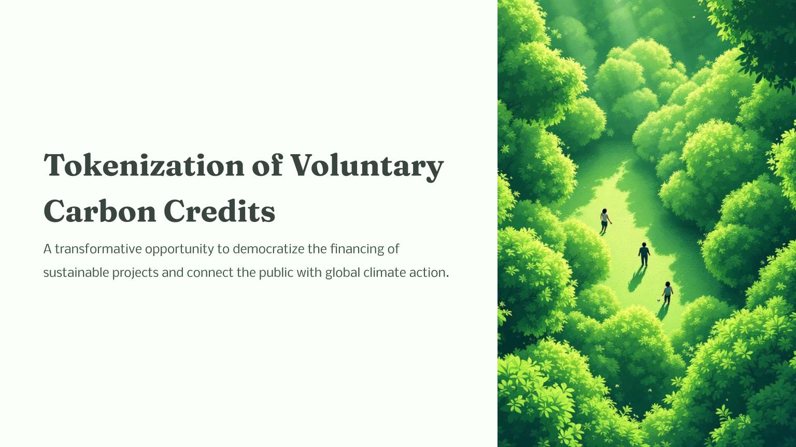  
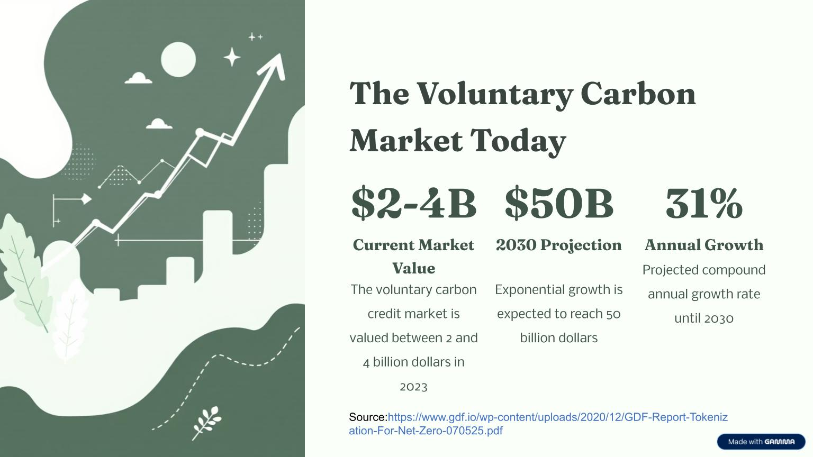  
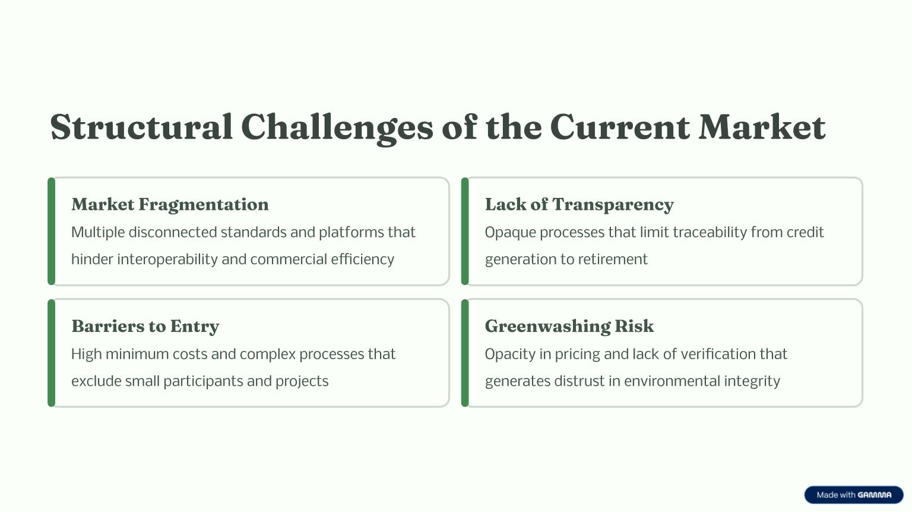  
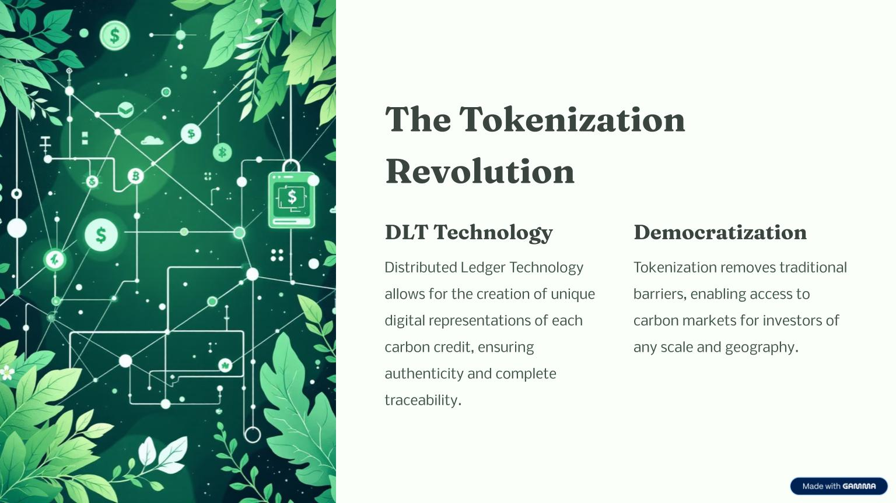  
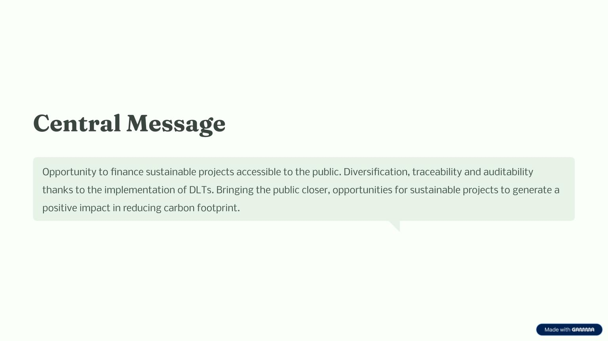  
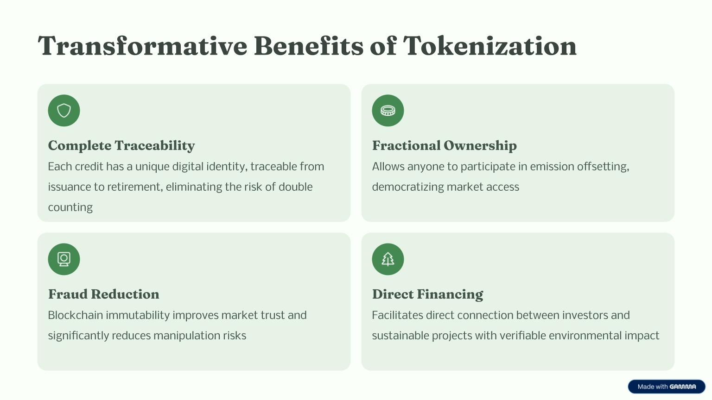  
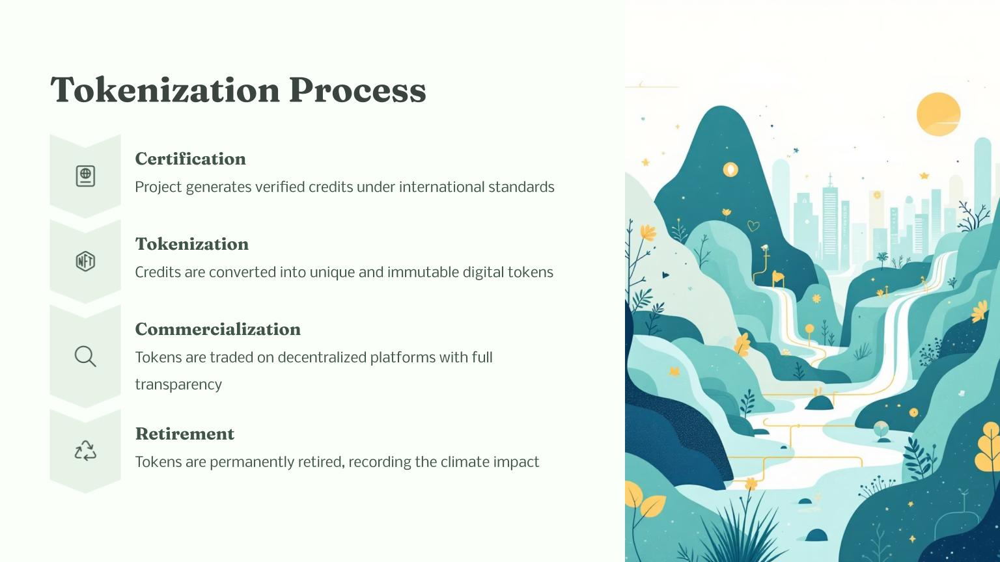  
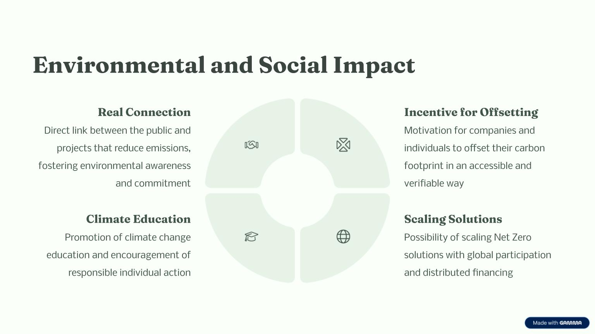  
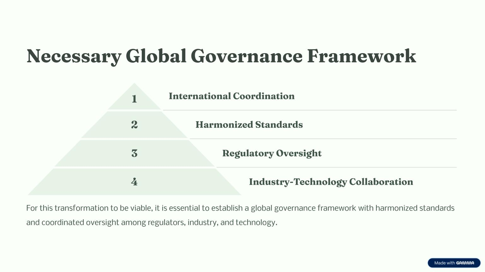  
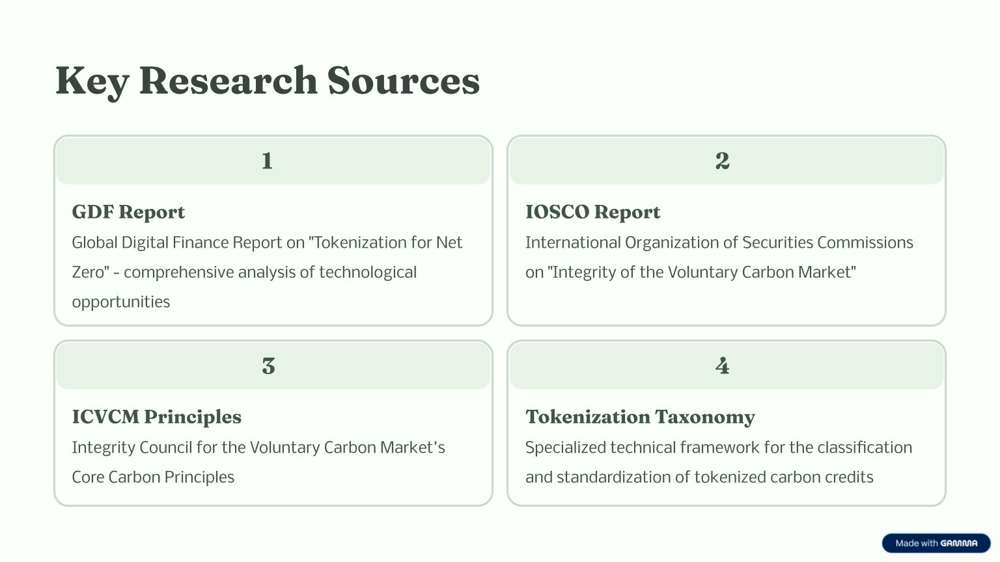  
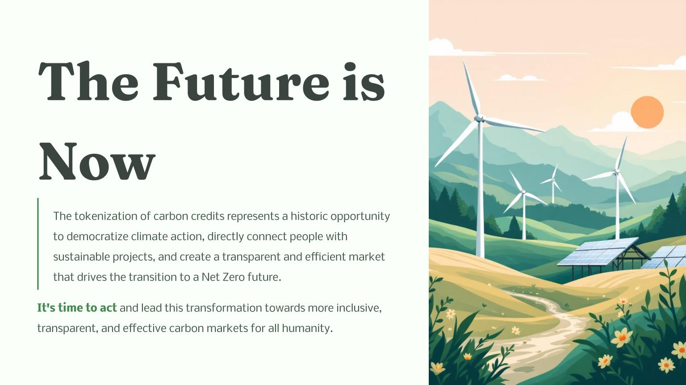

